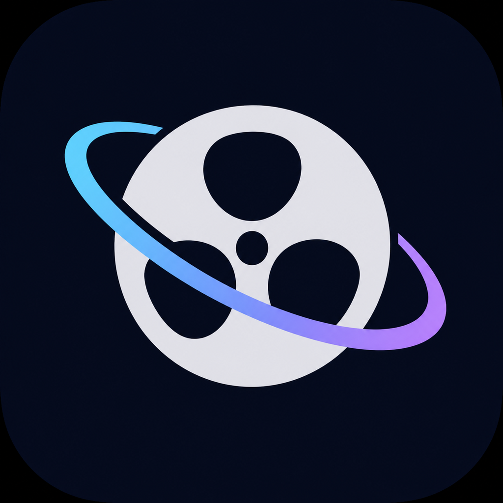

<div align="center">
  
  <h1>NoxReel</h1>
  <p><strong>把“我有这部片”，变成“我们现在一起看”。</strong></p>
  <p>深色、轻量的多人同步观影工具。支持本地视频 P2P 边传边播，也支持视频链接解析与同步播放。</p>

  <p>
    
    
    
    
  </p>

  <p>
    <a href="https://github.com/Felis-desuwa/NoxReel/releases/latest"><strong>下载最新版</strong></a>
    ·
    <a href="#快速开始">快速开始</a>
    ·
    <a href="https://github.com/Felis-desuwa/NoxReel/issues">反馈问题</a>
  </p>
</div>

<p align="center">
  
</p>

## 为什么是 NoxReel

| 🎞️ 边传边播 | 🔗 链接同步 | 👥 房间协作 |
|:---|:---|:---|
| 一个人持有本地视频，其他成员无需提前下载完整文件即可开始观看。 | 支持公开视频页面、MP4 直链和 HLS，房间只同步播放状态。 | 设置 2–16 人容量，显示成员连接速度与延迟，并自动等待缓冲最慢的人。 |

### 核心体验

- **最大 10 GB**：支持 MP4、MOV、M4V、MKV 本地视频。
- **短邀请码**：使用紧凑的 `NR2` 房间码，同时兼容旧版 `SW2` / `SW1`。
- **随时换片**：房主可在房间内切换本地视频或视频链接，成员不用退出重进。
- **缓冲联动**：任何成员可播余量不足时全员暂停，恢复后继续。
- **真实成员状态**：只显示已建立连接的用户，并给出上传、下载速度和延迟。
- **播放器可恢复**：播放器窗口关闭后，可从房间页面重新打开。
- **缓存自动清理**：接收视频和转封装副本只进入系统临时缓存，换片、退房或关闭软件时自动删除；异常残留会在下次启动时回收。
- **安全桌面外壳**：启用 Electron sandbox、受控 IPC 和安全 DOM 渲染，并使用与主界面统一的深色 Windows 标题栏。

> [!IMPORTANT]
> `v0.4.2` 将接收视频和转封装副本迁移到临时缓存，退出房间或软件时自动清理，并使用有上限的内存缓存减少磁盘读写；同时包含 `v0.4.1` 的全部安全修复。建议旧版用户升级。

## 下载

| 版本 | 适合谁 | 下载 |
|---|---|---|
| Windows 完整版 | 推荐。内置 mpv 与 yt-dlp，安装后即可使用 | [NoxReel-Setup-0.4.2.exe](https://github.com/Felis-desuwa/NoxReel/releases/latest/download/NoxReel-Setup-0.4.2.exe) |
| Windows 联网版 | 安装器体积小，安装时下载应用组件 | [NoxReel-WebSetup-0.4.2.exe](https://github.com/Felis-desuwa/NoxReel/releases/latest/download/NoxReel-WebSetup-0.4.2.exe) |
| Android 测试版 | 作为观众加入电脑端房间 | [app-debug.apk](https://github.com/Felis-desuwa/NoxReel/releases/latest/download/app-debug.apk) |
| SHA-256 | 校验下载文件是否完整 | [SHA256SUMS.txt](https://github.com/Felis-desuwa/NoxReel/releases/latest/download/SHA256SUMS.txt) |

> [!NOTE]
> Windows 安装包目前没有商业代码签名，系统可能显示“未知发布者”。请只从本仓库的 [Releases](https://github.com/Felis-desuwa/NoxReel/releases) 页面下载。

## 快速开始

1. 安装并启动 NoxReel。
2. 创建房间，设置人数上限。
3. 选择本地视频，或粘贴受支持的视频链接。
4. 把短邀请码发送给其他成员。
5. 成员加入后，房主即可统一控制播放、暂停和跳转。

```text
房主的视频 / 原网站
        ↓
   WebRTC P2P 直连
        ↓
成员边接收边播放  ←→  全房同步状态
```

## 两种连接方式

| 模式 | 操作 | 是否需要服务器 | 适合场景 |
|---|---|---:|---|
| 短邀请码房间 | 粘贴一次邀请码 | 需要轻量信令服务 | 日常多人使用 |
| 手动双码 | 交换邀请码与应答码 | 不需要 | 临时使用或不部署信令服务 |

信令服务器只交换 SDP、ICE 和房间状态，不读取或保存视频内容。严格 NAT、CGNAT 或防火墙环境可能需要自行配置 TURN 中继。

## 隐私与内容边界

- 本地视频分片通过加密的 WebRTC 连接在成员之间传输。
- 视频链接由每位成员直接从原始网站读取，不经过 NoxReel 信令服务器。
- 用户选择的源视频始终保持原样；软件生成的接收缓存不会保留在“下载”文件夹，也不提供跨重启断点续传。
- 桌面端启用 Chromium sandbox、上下文隔离和严格 CSP；所有特权操作均通过白名单 IPC 完成。
- 昵称、成员信息和错误内容通过文本节点渲染，不作为 HTML 执行。
- NoxReel 不绕过登录、付费墙、地区限制或 DRM。
- 本项目不提供内容搜索、资源索引或版权内容来源。

> 请仅分享和观看你有权使用的内容。

<details>
<summary><strong>技术结构</strong></summary>

| 组件 | 用途 |
|---|---|
| Electron | 桌面应用与房间界面 |
| mpv | 视频播放与 IPC 控制 |
| WebRTC DataChannel | P2P 视频分片传输 |
| WebSocket | 可选信令服务 |
| yt-dlp | 公共视频链接解析 |

本地文件采用分片校验与连续水位线机制：播放器只读取从文件开头起已经连续落盘的部分，避免读到未接收区域。热点分片使用有上限的内存缓存，相邻分片合并落盘，以减少多人传输时的重复磁盘读取和零碎写入。

</details>

<details>
<summary><strong>当前限制</strong></summary>

- 真实公网 NAT 穿透效果取决于双方网络，无法保证所有网络组合都能直连。
- TURN 中继需要使用者自行提供服务器与凭据。
- 10 GB 上限已覆盖清单拆分和稀疏文件逻辑；目前真实媒体端到端测试规模为 1.75 GB。
- Android 版本仍处于测试阶段，桌面端是当前主要体验。

</details>

## 从源码运行

需要 Node.js 20 或更新版本：

```powershell
git clone https://github.com/Felis-desuwa/NoxReel.git
cd NoxReel
npm install
npm start
```

### 常用命令

```powershell
npm test              # 运行测试
npm run signal        # 启动本地信令服务器
npm run dist:offline  # 构建 Windows 完整安装包
npm run dist:web      # 构建 Windows 联网安装器
```

完整安装包会自动携带 mpv 和 yt-dlp。从源码运行时，也可以通过兼容环境变量指定程序路径：

- `SYNCWATCH_MPV_PATH`
- `SYNCWATCH_YTDLP_PATH`
- `SYNCWATCH_FFMPEG_PATH`

## 参与项目

欢迎通过 [Issues](https://github.com/Felis-desuwa/NoxReel/issues) 报告问题或提出建议。提交问题时，请尽量附上系统版本、连接方式、媒体格式和可复现步骤。

## License

NoxReel 使用 [MIT License](LICENSE)。

<div align="center">
  <sub>Built for movie nights across distance.</sub>
</div>
